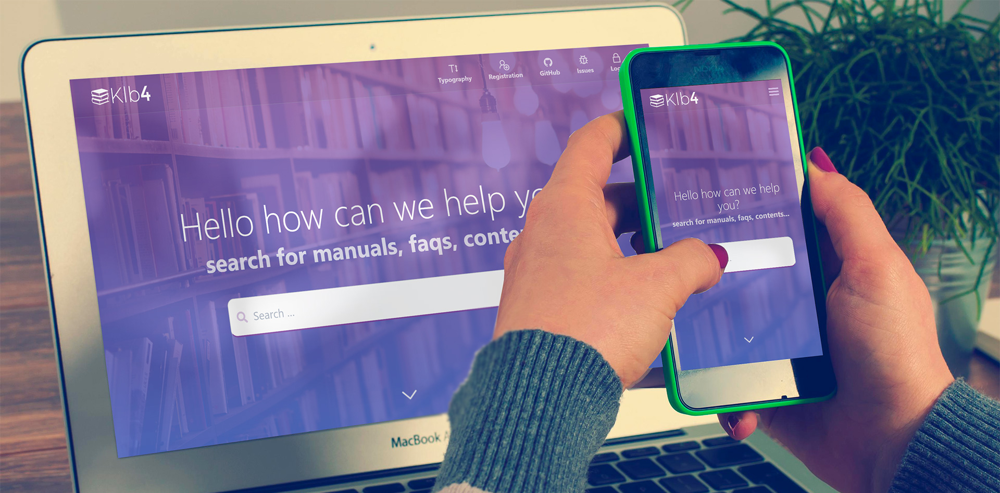

# Website Demo of Klb4 Grav Theme

How to install:

1) Do download zip file in Code button;
2) Unzip in a WebServer with PHP 7.1.3+. [Requirements here](https://learn.getgrav.org/16/basics/requirements);
3) Run `composer install` on root project;
4) Update grav version runing `bin/gpm selfupgrade -f`;
5) Access `/admin` for aministrative panel with user `klb4` and password `Klb4Gr4vTh3me!`;
6) Update plugins and theme;
7) Have faun :)

[Download only Theme](https://github.com/lauroguedes/grav-theme-klb4)