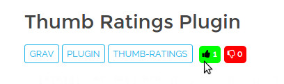

# Thumb Ratings Plugin



`Thumb Ratings` is a [Grav](http://github.com/getgrav/grav) Plugin that allows you to add a thumbs up/down to your posts.

# Installation

Installing the `Thumb Ratings` plugin can be done in one of two ways. The GPM (Grav Package Manager) installation method enables you to quickly and easily install the plugin with a simple terminal command, while the manual method enables you to do so via a zip file.

## GPM Installation (Preferred)

The simplest way to install this plugin is via the [Grav Package Manager (GPM)](http://learn.getgrav.org/advanced/grav-gpm) through your system's Terminal (also called the command line).  From the root of your Grav install type:

    bin/gpm install thumb-ratings

This will install the `Thumb Ratings` plugin into your `/user/plugins` directory within Grav. Its files can be found under `/your_site_grav/user/plugins/thumb-ratings`.

## Manual Installation

To install this plugin, just download the zip version of this repository and unzip it under `/your_site_grav/user/plugins`. Then, rename the folder to `thumb-ratings`. You can find these files either on [GitHub](https://github.com/iusvar/grav-plugin-thumb-ratings) or via [GetGrav.org](http://getgrav.org/downloads/plugins#extras).

You should now have all the plugin files under

    /your/site/grav/user/plugins/thumb-ratings

# Updating

As development for the `Thumb Ratings` plugin continues, new versions may become available that add additional features and functionality, improve compatibility with newer Grav releases, and generally provide a better user experience. Updating `Thumb Ratings` is easy, and can be done through Grav's GPM system, as well as manually.

## GPM Update (Preferred)

The simplest way to update this plugin is via the Grav Package Manager (GPM). You can do this with this by navigating to the root directory of your Grav install using your system's Terminal (also called command line) and typing the following:

    bin/gpm update thumb-ratings

This command will check your Grav install to see if your `Thumb Ratings` plugin is due for an update. If a newer release is found, you will be asked whether or not you wish to update. To continue, type y and hit enter. The plugin will automatically update and clear Grav's cache.

## Manual Update

Manually updating `Thumb Ratings` is pretty simple. Here is what you will need to do to get this done:

* Delete the `your/site/user/plugins/thumb-ratings` directory.

* Downalod the new version of the Thumb Ratings plugin from either [GitHub](https://github.com/iusvar/grav-plugin-thumb-ratings) or [GetGrav.org](http://getgrav.org/downloads/plugins#extras).

* Unzip the zip file in `your/site/user/plugins` and rename the resulting folder to `thumb-ratings`.

* Clear the Grav cache. The simplest way to do this is by going to the root Grav directory in terminal and typing `bin/grav clear-cache`.

Note: Any changes you have made to any of the files listed under this directory will also be removed and replaced by the new set. Any files located elsewhere (for example a YAML settings file placed in `user/config/plugins`) will remain intact.

# Usage

To use this plugin, you simplest way to display the link to print is to use the Twig function and pass it a dynamic value such as:

```
{{ thumbs(page.slug) }}
```

This will use the current page's route as the unique identifier.

The `Thumb Ratings` plugin comes with some sensible default configuration, that are pretty self explanatory:

## Config Defaults

```yaml
# Global plugin configurations.
enabled: true                   # Set to false to disable this plugin completely.
built_in_css: true              # Use built-in CSS of the plugin.

# Various checks
callback: '/thumb-ratings'      # A path that the plugin will look for when processing Ajax calls
unique_ip_check: false          # Ensures that a particular IP can only vote once
disable_after_vote: true        # Disable the interaction after the user has already made the vote
readonly: false                 # Set to readonly to disable all interaction

# Colors
up_bgcolor: '#00FF00'           # Background color thumb up
down_bgcolor: '#FF0000'         # Background color thumb down
up_color: '#ffffff'             # Color thumb up
down_color: '#ffffff'           # Color thumb down
```

If you need to change any value, then the best process is to copy the [thumb-ratings.yaml](thumb-ratings.yaml) file into your `users/config/plugins/` folder (create if doesn't exist), and modify it there. This will override the default settings.

# Acknowledgements

For this plugin I am grateful to the following:

* [Star Ratings Plugin](https://github.com/getgrav/grav-plugin-star-ratings)

* [star rating jQuery plugin](https://github.com/nashio/star-rating-svg)

# TODO

* Use technical cookies

* Show a single number, as an alternative to the double number (Up adds, Down subtracts)
